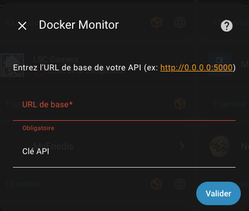
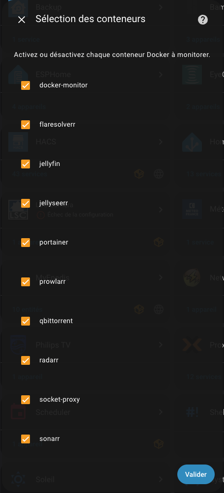
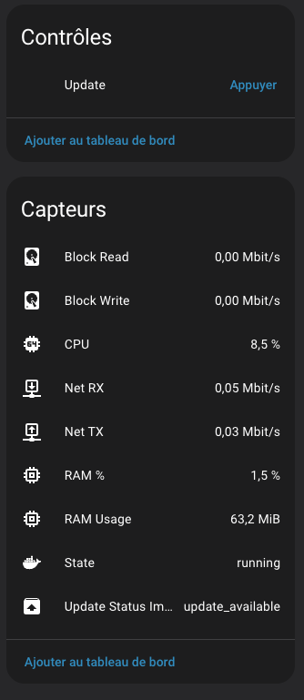

# 🇬🇧 English Version

# 🐳 Docker Monitor Image – Home Assistant Custom Integration

**Docker Monitor Image** is a custom integration for [Home Assistant](https://www.home-assistant.io/).  
It allows you to **monitor your Docker containers** and **update their images** via the companion app  
[Docker-Monitor-Image](https://github.com/vomfive/Docker-Monitor-Image).

> ⚠️ ⚠️ **Mandatory prerequisite:** this integration **only works** with  
> [Docker-Monitor-Image](https://github.com/vomfive/Docker-Monitor-Image)  
> installed and accessible on your network (exposed HTTP API).  
> Without this app, **no data** will be collected and **no updates** will be possible.

[](https://my.home-assistant.io/redirect/hacs_repository/?owner=vagvom&repository=lsc_camera_ha&category=integration)

---

## 📦 Installation

### Via HACS (recommended)

1. Open **HACS** → **Integrations** → click **+**
2. Add this custom repository: 
   ```
   https://github.com/vomfive/dockermonitorimage-ha
   ```
3. Install the integration and **restart Home Assistant**.

### Manual installation

1. Download or clone this repository:  
   ```bash
   git clone https://github.com/vomfive/dockermonitorimage-ha.git
   ```
2. Copy the `docker_monitor_image` folder into:  
   ```
   <config>/custom_components/
   ```
3. **Restart Home Assistant**.

---

## 🔧 Configuration

### Add via the user interface (UI)

1. Go to **Settings → Devices & Services → Add Integration**.
2. Search for **Docker Monitor Image**.
3. Enter:
   - **Base URL** of your API (e.g., `http://192.168.1.100:5000`)
   - **API key** (if required)
4. Select the Docker containers to monitor via the checkbox list.
5. Confirm to complete the setup.

---

## ✨ Features

- Automatic discovery of Docker containers via the API
- Selection of containers to monitor during installation or via **Configure**
- Sensors (CPU, RAM, network, disk, status, update)
- Button to trigger Docker image updates
- FR/EN translations

---

## 🖼️ Screenshots

Step 1 – API configuration  
  

Step 2 – Container selection  
  

View – Home Assistant dashboard  
  
---

## ❓ FAQ

Can I use the integration without Docker-Monitor-Image?  
No. This integration is just a connector to the Docker-Monitor-Image app API.

Why do the rates show 0 on the first refresh?  
Rates are calculated from cumulative counters; two successive readings are needed to get a speed.

---

## 📜 License
**CC BY-NC 4.0**  
This project is freely usable for **non-commercial** purposes.  
For professional or commercial use, please contact the author.  
[View the full license](https://creativecommons.org/licenses/by-nc/4.0/)

# 🇫🇷 Version Française

# 🐳 Docker Monitor Image – Home Assistant Custom Integration

**Docker Monitor Image** est une intégration personnalisée pour [Home Assistant](https://www.home-assistant.io/).  
Elle permet de **superviser vos conteneurs Docker** et de **mettre à jour leurs images** via l’application compagnon  
[Docker-Monitor-Image](https://github.com/vomfive/Docker-Monitor-Image).

> ⚠️ ⚠️ **Prérequis obligatoire :** cette intégration **fonctionne uniquement** avec  
> [Docker-Monitor-Image](https://github.com/vomfive/Docker-Monitor-Image)  
> installée et accessible sur votre réseau (API HTTP exposée).  
> Sans cette application, **aucune donnée** ne sera collectée et **aucune mise à jour** ne sera possible.

[](https://my.home-assistant.io/redirect/hacs_repository/?owner=vagvom&repository=lsc_camera_ha&category=integration)

---

## 📦 Installation

### Via HACS (recommandé)

1. Ouvrez **HACS** → **Intégrations** → cliquez sur **+**
2. Ajoutez ce dépôt personnalisé : 
   ```
   https://github.com/vomfive/dockermonitorimage-ha
   ```
3. Installez l’intégration et **redémarrez Home Assistant**.

### Installation manuelle

1. Téléchargez ou clonez ce dépôt :  
   ```bash
   git clone https://github.com/vomfive/dockermonitorimage-ha.git
   ```
2. Copiez le dossier `docker_monitor_image` dans :  
   ```
   <config>/custom_components/
   ```
3. **Redémarrez Home Assistant**.

---

## 🔧 Configuration

### Ajout via l'interface utilisateur (UI)

1. Allez dans **Paramètres → Appareils & Services → Ajouter une intégration**.
2. Recherchez **Docker Monitor Image**.
3. Entrez :
   - **URL de base** de votre API (ex: `http://192.168.1.100:5000`)
   - **Clé API** (si requise)
4. Sélectionnez les conteneurs Docker à superviser via la liste à cocher.
5. Confirmez pour terminer la configuration.

---

## ✨ Fonctionnalités

- Découverte automatique des conteneurs Docker via l'API
- Sélection des conteneurs à superviser lors de l'installation ou via **Configurer**
- Capteurs (CPU, RAM, réseau, disque, état, mise à jour)
- Bouton pour déclencher la mise à jour des images Docker
- Traductions FR/EN

---

## 🖼️ Captures d’écran

Étape 1 – Configuration de l’API
  

Étape 2 – Sélection des conteneurs
  

Vue – Tableau de bord Home Assistant
  
---

## ❓ FAQ

Puis-je utiliser l’intégration sans Docker-Monitor-Image ?
Non. Cette intégration n’est qu’un connecteur vers l’API de l’application Docker-Monitor-Image.

Pourquoi les débits affichent 0 au premier rafraîchissement ?
Les débits sont calculés à partir de compteurs cumulés ; il faut deux relevés successifs pour obtenir une vitesse.

---

## 📜 Licence
**CC BY-NC 4.0**  
Ce projet est librement utilisable à des fins **non commerciales**.  
Pour un usage professionnel ou commercial, merci de contacter l’auteur.  
[Consulter la licence complète](https://creativecommons.org/licenses/by-nc/4.0/)
